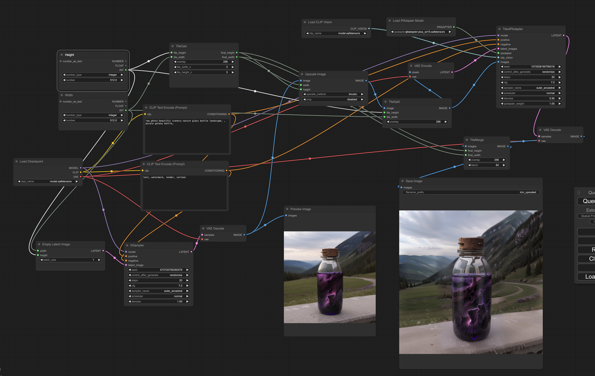

> [!CAUTION] 
> ComfyUI_IPAdapter_plus now have supports both tiled masks and unfolded batches of images. This project will not be maintained any more.

# TiledIPAdapter

Proof of concept: how to use IPAdapter to control tiled upscaling. 

You need to have https://github.com/cubiq/ComfyUI_IPAdapter_plus installed.

Give it a batch of latents and images, and it will do img2img with the images used as IPAdapter input. For each image/latent pair it will take the input model and condition it with the image, then use the latent as input to a regular img2img. 

The regular IPAdapter takes the full batch of images and creates ONE conditioned model, this instead creates a new one for each image.

The node relies on the IPAdapter code, so the same limitations apply. Images should preferably be square.

To split an image into tiles and merge it again you can use the SimpleTile nodes: https://github.com/kinfolk0117/ComfyUI_SimpleTiles 

# Example workflow
Drag into Comfy to load workflow:

.

